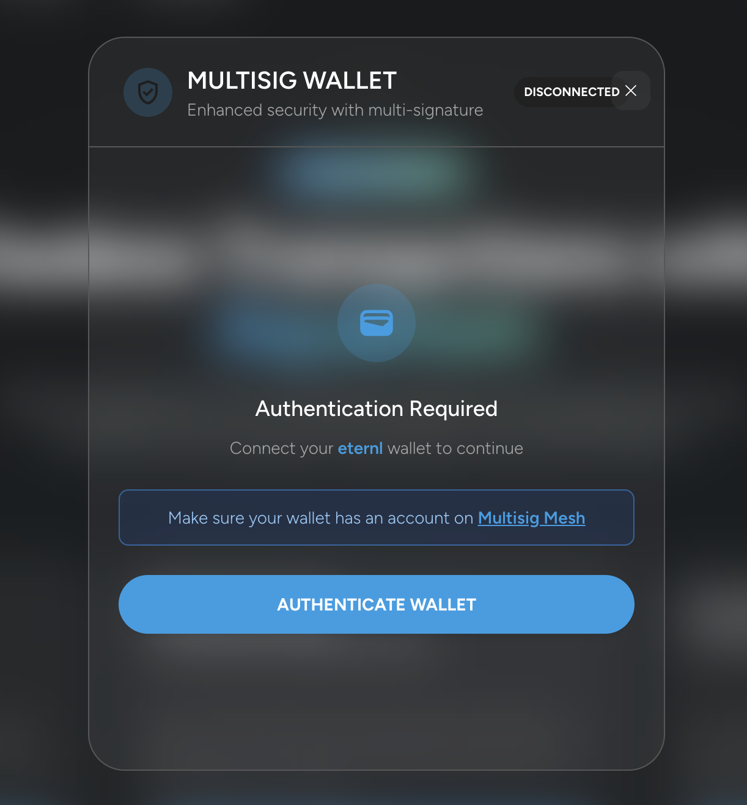
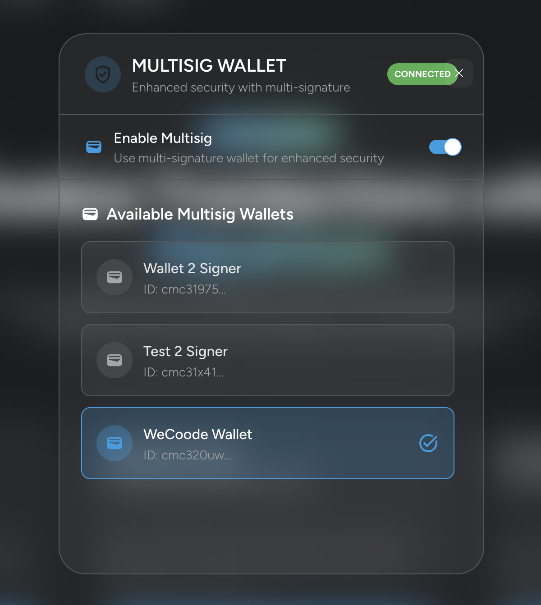

# Mesh Multisig — Integration

This brief guide explains how **Mesh Multisig** was integrated into a DApp, using **FluidTokens' Aquarium** platform as a case study.

## 📌 Introduction

**Mesh Multisig** exposes APIs that allow interaction with multisig wallets created on the [multisig.meshjs.dev](http://multisig.meshjs.dev/) platform.  
This simplifies and makes it easy to integrate multisig functionality into other DApps, leaving all participant management, signing, and wallet creation logic handled by **Mesh**.  
The result is a clean, scalable, and fast integration.

---

## 🔧 Implementation

To integrate multisig functionality into the React application, custom utility classes and a React context were implemented directly in the project.

### 1️⃣ Create the `MeshMultisigWallet` utility class

First, instantiate the `MeshMultisigWallet` class in your core utilities:

```typescript
const meshWallet = new MeshMultisigWallet(
  'maestro', // Provider: blockfrost or maestro
  process.env.NEXT_PUBLIC_MAESTRO_KEY as string, // Provider API Key
  process.env.NEXT_PUBLIC_MULTISIG_MESH_NETWORK as AllSupportedNetworks, // MAINNET or TESTNET
  MeshMultisigApiVersion.V1 // API Version
);
```

### 2️⃣ Create a React Context

A React Context (`MeshMultisigWalletContext`) was implemented to manage the multisig wallet state throughout the application, with a custom hook (`useMeshMultisigWallet`) to access the context values.

### 3️⃣ Wrap the app with the Provider

```typescript
export default function Providers({ children }: { children: React.ReactNode }) {
  return (
    <MeshMultisigWalletProvider meshMultisigWallet={meshWallet}>
        {children}
    </MeshMultisigWalletProvider>
  );
}
```

---

## ⚙️ Usage in Aquarium

Now, throughout the React application, you can use the custom hook that exposes utility values and a `wallet` object to:
- Interact with the Mesh Multisig APIs (including the authentication flow)
- Connect with your browser wallet
- Use utility functions like `getMultisigWalletAddress`

Example:

```typescript
const { wallet, isAuthenticated, isConnected } = useMeshMultisigWallet();
```

### ✳️ Authentication

To authenticate, simply call:

```typescript
await wallet.connectWallet(walletName);
```

This will connect the wallet to the DApp (if needed) and run the authentication flow required to access the APIs.

### ✳️ Selecting the multisig wallet

After authenticating, you can retrieve the available multisig wallet IDs for the user and allow them to select one.

To select the multisig wallet:

```typescript
await wallet.setSelectedMultisigWallet(walletItem);
```

---

## 📝 Using the multisig wallet

Once authenticated and a multisig wallet is selected, you can interact with it.  
On **Aquarium**, both a classic wallet and a multisig wallet were supported by mapping all the functionalities requiring a wallet, and dynamically adapting behavior depending on which one is connected.

### 📦 Example: Fetching UTXOs

At runtime, different methods are called depending on the situation:

```typescript
async getUtxos() {
  const { useMultisig, multisigWallet } = this.multisigData;

  if (useMultisig) {
    if (!multisigWallet) {
      throw new Error('Multisig wallet not initialized');
    }
    return await multisigWallet.getFreeUTxOs();
  } else {
    const wallet = await this.ensureWalletInitialized();
    return await wallet.getUtxos();
  }
}
```

### 📤 Example: Submitting a transaction

In the case of multisig, the transaction must be submitted via API so that other signers can approve it:

```typescript
async submitTransaction(signedTx: string, txJson: string): Promise<string> {
  const { useMultisig, multisigWallet, multisigStorage } = this.multisigData;

  if (useMultisig) {
    if (!multisigWallet || !multisigStorage) {
      throw new Error('Multisig wallet not initialized');
    }

    const wallet = await this.ensureWalletInitialized();

    const tx = await multisigWallet.addTransaction({
      walletId: multisigWallet.getSelectedMultisigWallet()?.walletId ?? '',
      txCbor: signedTx,
      txJson: txJson,
      description: `Aquarium transaction`,
      address: await wallet.getChangeAddress()
    });
    return tx.txCbor;
  } else {
    const wallet = await this.ensureWalletInitialized();
    return await wallet.submitTx(signedTx);
  }
}
```

---

## 🎥 Demo video and images

Below are some images and a demo video of the integrated functionality on **Aquarium**.

---

### 📸 Images

**Wallet authentication**



---

**Selecting the multisig wallet**



---

**Creating and submitting a transaction**


---

### 🎞️ Demo video

**Aquarium + Mesh Multisig Integration**  
Watch the demo video:

📹 [Demo video](./video/aquarium.mov)
