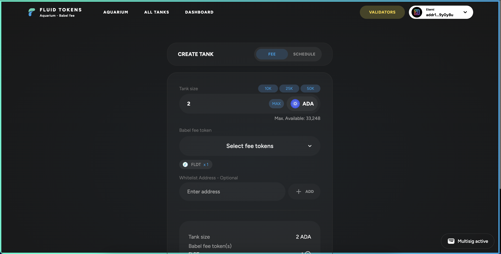

# Mesh Multisig — Integrazione

Questa breve guida illustra come sia stato possibile integrare **Mesh Multisig** all’interno di una DApp, prendendo come caso studio la piattaforma **Aquarium** di **FluidTokens**.

## 📌 Introduzione

**Mesh Multisig** espone delle API con cui è possibile interagire con i wallet multisig creati sulla piattaforma [multisig.meshjs.dev](http://multisig.meshjs.dev/). Questo approccio semplifica e rende facilmente integrabili in altre DApp le funzionalità di multisig, lasciando tutta la logica di gestione dei partecipanti, firme e creazione multisig direttamente sulla piattaforma **Mesh**.  
Il risultato è un’integrazione veloce, pulita e scalabile.

---

## 📚 Libreria

Per semplificare l’interazione con i wallet multisig, è stata realizzata una piccola libreria per applicazioni **React**.  

Per esporre tutta l’applicazione React alle funzionalità multisig è sufficiente:

### 1️⃣ Istanziare la classe `MeshMultisigWallet`

```typescript
const meshWallet = new MeshMultisigWallet(
  'maestro', // Provider: blockfrost o maestro
  process.env.NEXT_PUBLIC_MAESTRO_KEY as string, // API Key del provider
  process.env.NEXT_PUBLIC_MULTISIG_MESH_NETWORK as AllSupportedNetworks, // MAINNET o TESTNET
  MeshMultisigApiVersion.V1 // Versione API
);
```

### 2️⃣ Wrappare l’intera app con il relativo Provider

```typescript
export default function Providers({ children }: { children: React.ReactNode }) {
  return (
    <MeshMultisigWalletProvider meshMultisigWallet={meshWallet}>
        {children}
    </MeshMultisigWalletProvider>
  );
}
```

---

## ⚙️ Utilizzo in Aquarium

Ora, in tutta l’applicazione React, è possibile utilizzare un hook che espone alcune utility e un oggetto `wallet` per:
- Interagire con le API di Mesh Multisig (incluso il flow di autenticazione)
- Connettersi con il proprio browser wallet
- Utilizzare utility come `getMultisigWalletAddress`

Esempio:

```typescript
const { wallet, isAuthenticated, isConnected } = useMeshMultisigWallet();
```

### ✳️ Autenticazione

Per autenticarsi, basta usare il metodo:

```typescript
await wallet.connectWallet(walletName);
```

Questo connetterà il wallet alla DApp (se necessario) ed eseguirà il flow di autenticazione richiesto per accedere alle API.

### ✳️ Selezione del wallet multisig

Dopo essersi autenticati, si possono recuperare gli ID dei wallet multisig disponibili per l’utente e permettere la selezione di uno di essi.

Per selezionare il wallet multisig:

```typescript
await wallet.setSelectedMultisigWallet(walletItem);
```

---

## 📝 Utilizzo del wallet multisig

Una volta autenticato e selezionato il wallet multisig, è possibile interagire con esso.  
Su **Aquarium** è stata gestita la possibilità di usare sia un wallet classico che un wallet multisig, mappando tutte le funzionalità in cui è richiesto l’uso del wallet per adattare di volta in volta il comportamento.

### 📦 Esempio: Recupero degli UTXO

A runtime vengono chiamati metodi diversi in base alla situazione:

```typescript
async getUtxos() {
  const { useMultisig, multisigWallet } = this.multisigData;

  if (useMultisig) {
    if (!multisigWallet) {
      throw new Error('Multisig wallet non inizializzato');
    }
    return await multisigWallet.getFreeUTxOs();
  } else {
    const wallet = await this.ensureWalletInitialized();
    return await wallet.getUtxos();
  }
}
```

### 📤 Esempio: Submit della transazione

Nel caso di multisig, la transazione deve essere inviata tramite API, così che gli altri firmatari possano approvarla:

```typescript
async submitTransaction(signedTx: string, txJson: string): Promise<string> {
  const { useMultisig, multisigWallet, multisigStorage } = this.multisigData;

  if (useMultisig) {
    if (!multisigWallet || !multisigStorage) {
      throw new Error('Multisig wallet non inizializzato');
    }

    const wallet = await this.ensureWalletInitialized();

    const tx = await multisigWallet.addTransaction({
      walletId: multisigWallet.getSelectedMultisigWallet()?.walletId ?? '',
      txCbor: signedTx,
      txJson: txJson,
      description: `Aquarium transaction`,
      address: await wallet.getChangeAddress()
    });
    return tx.txCbor;
  } else {
    const wallet = await this.ensureWalletInitialized();
    return await wallet.submitTx(signedTx);
  }
}
```

---

## 🎥 Video dimostrativo e immagini

Di seguito alcune immagini e un video dimostrativo della funzionalità integrata su **Aquarium**.

---

### 📸 Immagini

**Autenticazione al wallet**


---

**Selezione del wallet multisig**


---

**Creazione e invio di una transazione**



---

### 🎞️ Video demo

**Aquarium + Mesh Multisig Integration**  
Guarda il video dimostrativo:

📹 [Video dimostrativo](./video/aquarium.mov)
